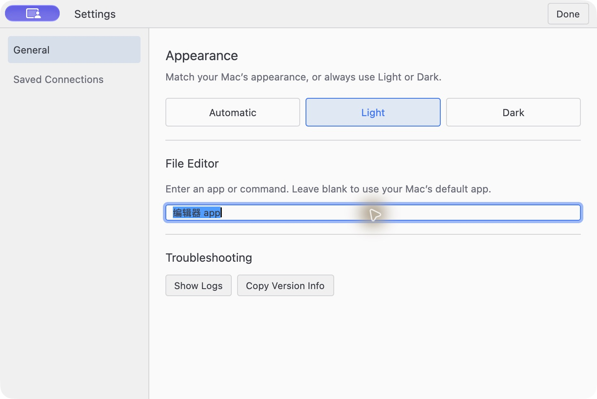
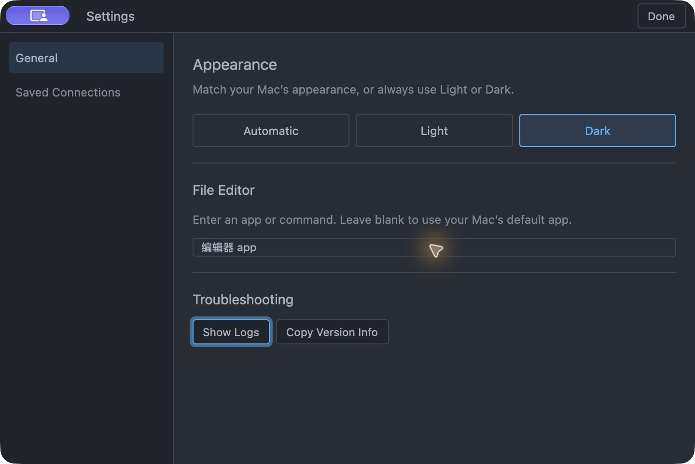
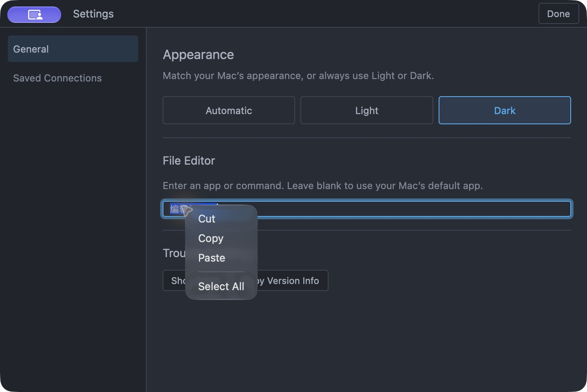

# GPUI Base migration visual evidence

Captured on macOS 27.0 (26A428), 2026-10-10 (Asia/Shanghai). The preview uses the application/UI/native-menu source from this branch, a separate bundle identifier and isolated local configuration. Only the test text `编辑器 app` is shown; no credentials or remote sessions are used.

The preview window is 720×480 logical pixels. The committed PNGs are 1440×960 Retina captures. Preview-only changes select the isolated home/configuration directory and initial window size; production renderers and menu scheduling are unchanged.

| Capture | Review points |
| --- | --- |
| [Light input selection](light-input-selection.png) | Compact ordinary input, Unicode selection, caret/focus border, light theme |
| [Dark button focus](dark-button-focus.png) | Keyboard Tab reaches the button, focus ring, compact button geometry, dark theme |
| [Native menu enabled](native-menu-enabled.png) | AppKit popup over a selected input, Cut/Copy/Paste/Select All and separator |

The native menu image comes from the combined accessibility/screenshot capture; a window-only capture omits the separate AppKit popup. These images are review evidence, not automated pixel-diff baselines.

Automated coverage checks frozen geometry at 160px and 480px widths, ordinary-input IME/focus/clipboard behavior, button keyboard activation and disabled behavior, and two-window theme defaults. The menu scheduler tests use actual GPUI window updates and replace only the synchronous OS tracking loop. They cover closing before presentation, closing during tracking, changing focus during tracking, and ten successive cancellations followed by a successful action. They do not simulate AppKit's internal event loop or prove native-view retention through a real OS-window teardown; the native FFI ownership boundary is documented separately in `crates/native-menu/src/macos.rs`.
